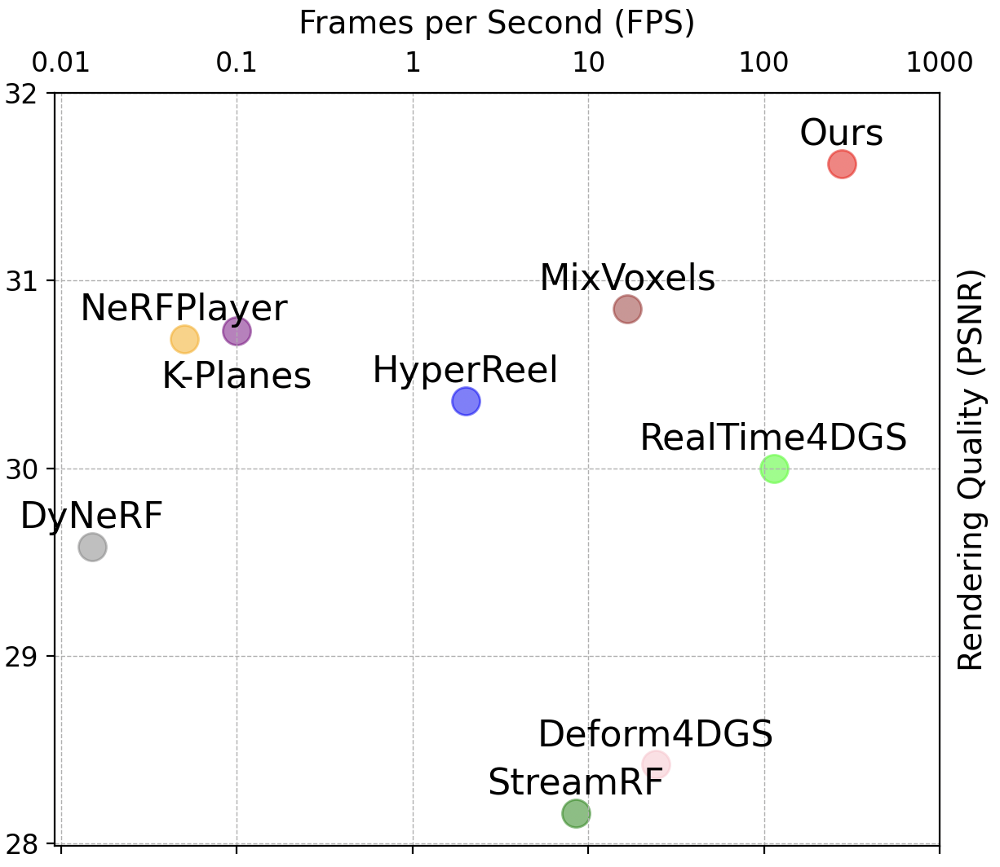
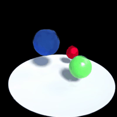
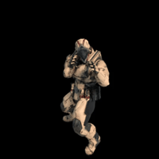
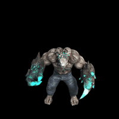
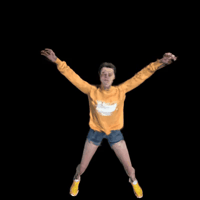
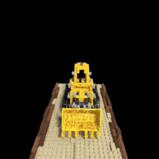
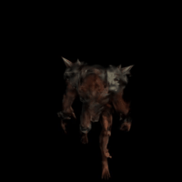
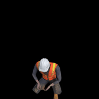
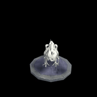

# 4D-Rotor Gaussian Splatting: Towards Efficieant Novel View Synthesis for Dynamic Scenes

### Proc. SIGGRAPH 2024

#### [arXiv Paper](https://arxiv.org/abs/2402.03307) | [Project Page]
---
Our method converges very quickly and achieves real-time rendering speed.
<p align="center">
    
    
</p>
The following are the results of our method on the D-NeRF dataset.
<p align="center">
    
    
    
    
    
    
    
    
</p>
Also, our method can also be applied in 3D and achieve consistent results with 3D Gaussian.
<p align="center">
    
</p>

## 1. Installation

### Prerequisites

You must have an NVIDIA video card with CUDA installed on the system. This library has been tested with version 11.8 of CUDA. You can find more information about installing CUDA [here](https://docs.nvidia.com/cuda/cuda-quick-start-guide/index.html).

### Create environment

This code base requires `python >= 3.8`. We recommend using conda to manage dependencies. Make sure to install [Conda](https://docs.conda.io/miniconda.html) before proceeding.

```bash
conda create --name 4drotorgs -y python=3.8
conda activate 4drotorgs
pip install --upgrade pip
```

### Dependencies
 
Install other packages including PyTorch with CUDA (this repo has been tested with CUDA 11.8), [tiny-cuda-nn](https://github.com/NVlabs/tiny-cuda-nn), and PyTorch3D.
`cuda-toolkit` is required for building `tiny-cuda-nn`.

For CUDA 11.8:

```bash
pip install torch==2.1.2+cu118 torchvision==0.16.2+cu118 --extra-index-url https://download.pytorch.org/whl/cu118

conda install -c "nvidia/label/cuda-11.8.0" cuda-toolkit
pip install ninja git+https://github.com/NVlabs/tiny-cuda-nn/#subdirectory=bindings/torch
pip install --no-index --no-cache-dir pytorch3d -f https://dl.fbaipublicfiles.com/pytorch3d/packaging/wheels/py38_cu118_pyt200/download.html
pip install --upgrade pip setuptools
```

If you got any issues from the above installation, see [Installation documentation](https://github.com/nerfstudio-project/nerfstudio/blob/main/docs/quickstart/installation.md) from nerfstudio for more.

### Installing 4D-Rotor Gaussians

```bash
git clone https://github.com/weify627/4D-Rotor-Gaussians.git
cd 4D-Rotor-Gaussians; pip install -e .
cd libs/diff-gaussian-rasterization-confidence; pip install .
cd ../knn; pip install .
cd ../knn_ops_3_fwd_bwd_mask; pip install .
```
If you have successfully reached here, you are ready to run the code! 


## 2. Dataset Preparation:
### For synthetic scenes from D-NeRF Dataset:
The dataset provided in [D-NeRF](https://github.com/albertpumarola/D-NeRF) is used. You can download the dataset from [dropbox](https://www.dropbox.com/s/0bf6fl0ye2vz3vr/data.zip?dl=0) at `$data_root$/dnerf`.
### For real dynamic scenes from N3V Dataset (also called Plenoptic Video
Dataset in our paper):
Download the [Neural 3D Video dataset](https://github.com/facebookresearch/Neural_3D_Video) and preprocess the raw video by executing:
```
python scripts/n3v2blender.py $data_root$/N3V/$scene_name$
```
## 3. Training
### Train model
For training synthetic scenes from D-NeRF Dataset such as `bouncingballs`, run 
```
ns-train splatfacto --data $data_root$/dnerf/bouncingballs
```
For training real dynamic scenes from N3V Dataset such as `cook_spinach`, run 
```
ns-train splatfacto-big --data $data_root$/N3V/cook_spinach --pipeline.model.path $data_root$/N3V/cook_spinach
```
One exception is for `flame_salmon` in N3V Dataset, run
```
ns-train splatfacto-big --data $data_root$/N3V/flame_salmon --pipeline.model.path $data_root$/N3V/flame_salmon --max_num_iterations 16000
```

## 4. Rendering and Evaluation

### Render testing images 
Run the following command to render the images.  
```bash
ns-render dataset --load_config $path_to_your_experiment$/config.yml --output-path $path_to_your_experiment$ --split test
```
If you followed all the previous steps, `$path_to_your_experiment$` should look
something like `outputs/bouncing_balls/splatfacto/2024-XX-XX_XXXXXX`.
### Evaluation
```bash
python scripts/metrics.py $path_to_your_experiment$/test
```

# Citation

The codebase is based on [Nerfstudio](https://github.com/nerfstudio-project/nerfstudio).

```
@inproceedings{duan:2024:4drotorgs,
   author = "Yuanxing Duan and Fangyin Wei and Qiyu Dai and Yuhang He and Wenzheng Chen and Baoquan Chen",
   title = "4D-Rotor Gaussian Splatting: Towards Efficient Novel View Synthesis for Dynamic Scenes",
   booktitle = "Proc. SIGGRAPH",
   year = "2024",
   month = July
}
```

